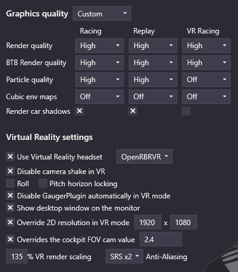

# Frequently asked questions

## My FPS is worse than what it is in RBRVR

- Disable cubic env maps
- Make sure anti-aliasing is not too high. Generally 4x SRS is the highest you
  can go and most systems can't go over 2x SRS.
- If neither of those work, go to `Options -> Plugins -> openRBRVR -> Debug
  settings -> Always call Present` and set it to `OFF`. Then restart the game.

## How do I reset the VR view?

- Bind a button via `Options -> Plugins -> RBR Controls -> Page 2 -> Reset VR view`

## How do I move the seat?

- Enable 3-2-1 countdown pause from `Controls` page of RSF launcher to have
  time to adjust the seat before starting a stage.
- Open PaceNote plugin by double clicking the RBR window with right mouse
  button. Adjust the seat, hit save and close the window from the `X` in
  top-right corner.

## Particles are coming inside the car

- There is a [rendering bug](https://github.com/Detegr/openRBRVR/issues/3) that
  causes the particles to be too visible inside the car. It is normal to get
  some particles into the car because that is how RBR works. You can turn
  particles off if they're distracting.

## How do I enable anisotropic filtering?

RSF launcher does not show an option to change anisotropic filtering. It can be
changed by modifying `dxvk.conf` by hand:

- `d3d9.samplerAnisotropy` Use one of 0, 2, 4, 8 or 16.

## The texts in RBR menus are missing

- Increase 2D resolution to 800x600 or above.

## The game is always shown on a "screen" within the VR environment

- This is normal for menus. If this happens also when driving, install SteamVR.

## What graphics settings should I use?

- Depends on the hardware. I use SteamVR at 100% scaling with the following settings in the RSF launcher:

## There is shimmering and/or flickering of certain textures

- This can happen without Anti-Aliasing and/or anisotropic filtering. Increase
  anisotropic filtering and try increasing Anti-Aliasing if your system can
  handle it.
