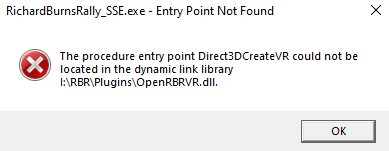

# Často kladené dotazy

[🇬🇧](FAQ.md) - [🇨🇿](FAQ_CZ.md) - [🇫🇷](FAQ_FR.md)

## Plugin se nespustí

### Direct3DCreateVR is missing

Soubor `d3d9.dll` není z openRBRVR pluginu. RSF launcher někdy špatně prohodí soubory.
Pro vyřešení problému zkuste následující postup:

- Ukončete RBR
- Změňte nastavení VR pluginu na RBRVR a pak zpět na openRBRVR (pokud máte oba nainstalovaný).

Pokud to nepomůže, zkuste následující kroky:

- Ukončete RBR
- Vypněte VR mód v RSF launcheru a ujistěte se, že 2D fullscreen mód je nastaven na "Normal" a NE na "Vulkan".
- Zavřete RSF launcher a spusťte RSF instalátor a vyberte "Update Existing Installation" (nezapomeňte zaškrtnout RBRVR i openRBRVR plugin v seznamu).

### Hra hned spadne na plochu (desktop)

- Pokud máte Light plugin, tak se ujistěte, že ho máte zakázaný. openRBRVR není s tímto pluginem kompatibilní.
- Jestli používáte openXR, tak se ujistětem že je váš headset podporován.

## Můžu použít OpenXR místo OpenVR/SteamVR?

OpenXR je podporován u headsetů, které mají dostupný 32-bit OpenXR runtime.
V následující tabulce se můžete podívat jestli ho váš headset podporuje:

| Výrobce      | Runtime                                                                    | Podpora     | Komentář                                                                    |
| ------------ | -------------------------------------------------------------------------- | ----------- | --------------------------------------------------------------------------- |
| Pimax        | [Pimax-OpenXR](https://github.com/mbucchia/Pimax-OpenXR)                   | ✅          |                                                                             |
| Oculus       | Oculus OpenXR or [VDXR](https://github.com/mbucchia/VirtualDesktop-OpenXR) | ✅          |                                                                             |
| Pico         | [VDXR](https://github.com/mbucchia/VirtualDesktop-OpenXR)                  | ✅          |                                                                             |
| Reverb       | WMR                                                                        | ✅          |                                                                             |
| Valve        | SteamVR OpenXR                                                             | ⛔          | Nemá podporu 32-bit runtime                                                 |
| Varjo        | Varjo OpenXR                                                               | ⛔          | Nemá podporu 32-bit runtime                                                 |

OpenXR runtime zapnete v `Options (Nastavení) -> Plugins -> openRBRVR -> VR runtime` nebo editací `openRBRVR.toml`
a upravením řádku `runtime = 'openxr'`.

## OpenComposite chyba: unsupported apptype

openRBRVR má nativní podporu OpenXR implementace. OpenComposite proto není vyžadován.
Pokud chcete spustit openRBRVR v OpenXR modu, zkuste toto nastavení:
V nastavení OpenComposite switcheru zakažte `RichardBurnsRally_SSE.exe` v `SteamVR` modu.

Případně kompletně odstraňte OpenComposite instalaci ze systému.

## Moje FPS jsou horší než v RBRVR pluginu

- Ujistěte se, že nemáte nastavenou hodnotu anti-aliasingu moc vysoko. Obvykle je hodnota 4x SRS nejvyšší
  jakou dokáže počítač zvládnout (hodně záleží na PC sestavě a použitém VR). U většiny systémů
  použijte hodnotu 2x SRS, případně anti-aliasing úplně vypněte.
- Pokud nepotřebujete co-driver mod (bonnet camera desktop window mode), tak se podívejte do
  `Options (Nastavení) -> Plugins -> openRBRVR -> Desktop window settings -> Desktop window mode` 
  a použijte `VR view` nebo `Off` pro dosažení více fps.
- Pokud používáte RBRHUD, tak můžete narazit na auta, která používají dva RBRHUD konfigurační soubory.
  Díky tomu může být výkon ve VR až o 30% horší než bez RBRHUDu. Proto přejmenujte nebo smažte soubor `config2.ini`
  z `Plugins/RBRHUD/Gauges/carname`.  

## Jak resetovat (vycentrovat) obraz ve VR?

- Nastavte si tlačítko přes `Options (Nastavení) -> Plugins -> RBR Controls -> Page 2 -> Reset VR view`

## Jak si můžu posunout sedačku/pohled?

- V RSF launcheru klikněte na `Controls` respektivě `Ovládání` a  
  povolte `3-2-1 countdown pause` respektivě `Odpočítávání 3-2-1 pozastaveno` díky čemuž získáte čas na
  nastavení pohledu před startem RZety.
- Před startem RZety otevřete PaceNote plugin dvojklikem pravým tlačítkem myši v okně hry a pohled si nastavte.
  Nezapomeňte si polohu uložit kliknutím na tlačítko `Save` respektivě `Uložit` a zavřete okno s nastavením
  kliknutím na `X` v pravém horním rohu.
  
## Jak si zapnu anizotropního filtrování?

RSF Launcher nezobrazuje nastavení pro jeho změnu, proto musíte ručně změnit
soubor `dxvk.conf` přidáním/přepsáním řádku:
`d3d9.samplerAnisotropy = `

Použitelné hodnoty: 0, 2, 4, 8 nebo 16

## Texty v menu ve hře nejsou vidět

- Zvyšte 2D rozlišení na 800x600 nebo větší.

## Hru vidíte vždy jakoby na obrazovce a ne ve 3D v brýlích

- Tohle chování je standardně nastaveno pro menu. Pokud se to děje i při jízdě, tak nainstalujte SteamVR.

## Jaké nastavení grafiky mám použít?

- Hodně záleží na vaší PC sestavě. Používám SteamVR render resolution na 100% a anizotropní filtrování na 16x
s tímto nastavením v RSF launcheru:

## U některých textur vidím jejich problikávání

- K tomu dochází bez zapnutého Anti-Aliasingu a/nebo anizotropního filtrování. Zvyšte
  anizotropní filtrování a potom i anti-aliasing, pokud to vaše PC utáhne.

## Jak nastavím anti-aliasing pro jednotlivé tratě?

- Nejlepší je nastavit základní vyhlazování v RSF launcheru na 2x SRS nebo 4x SRS
a potom v sekci `[gfx]` snížit tuto hodnotu (například u BTB tratí) nastavením na 0.
Příklad neleznete v souboru `openRBRVR.toml.sample`.

## Podporuje openRBRVR foveated rendering?

- Ano. U všech headsetů [podporujících 32-bit OpenXR](https://github.com/Detegr/openRBRVR/blob/master/FAQ.md#can-i-use-openxr-instead-of-openvrsteamvr).
  Musíte povolit quad view rendering z `Options (Nastavení) -> Plugins ->
  openRBRVR -> OpenXR settings -> Use quad-view rendering`
- Po nainstalování a spuštění hry se můžete podívat na Debug informace
  (`Options (Nastavení) -> Plugins -> openRBRVR -> Debug settings -> Debug
  information`) jestli zobrazují dvě rozdílná rozlišení pro peripheral a focus pohledy.
- Foveated rendering používá open source OpenXR layer, který se stará o všechnu těžkou práci.
  Informace o dalším nastavení a jemném doladění naleznete na 
  [Quad-Views-Foveated layer
  documentation](https://github.com/mbucchia/Quad-Views-Foveated/wiki/Advanced-Configuration)
